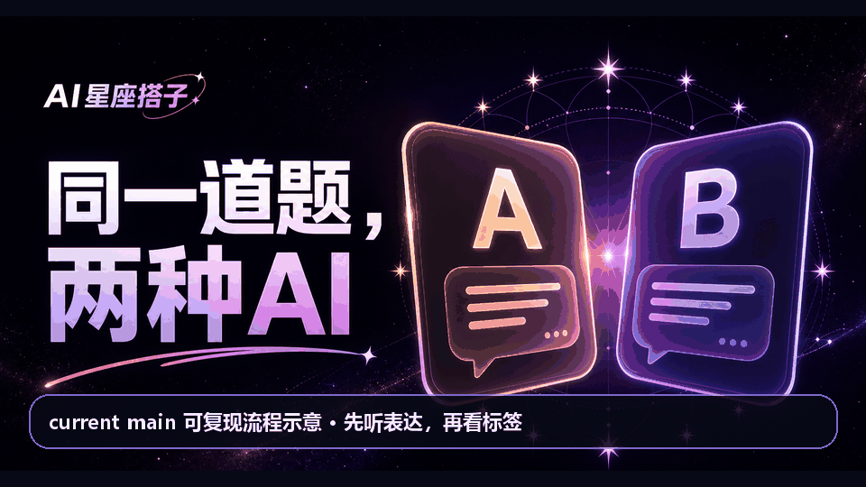

# AI星座搭子

> **让 AI 换一种说法，不换事实。**

[](https://github.com/yewending/zodiac-persona-kit/actions/workflows/ci.yml)
[](LICENSE)


**[在线体验：匿名同题 A/B →](https://zodiac-persona-kit.clear-gnome-6249.chatgpt.site/)** · **[安装 12 套沟通 Skill →](https://github.com/yewending/zodiac-communication-skill#安装--installation)**



> 动图是基于当前 `main` 的同版本本地可复现流程示意，不是公开站录屏；页面状态、审核预置 A/B 文案与确认路径均来自本仓库。公开体验可能受网络、地区或托管服务状态影响。

AI星座搭子是一个中文 AI 沟通人格体验项目。V0.2 用“同题双声道”让用户直接比较两种表达方式，完成选择、揭示差异、确认人格，并继续聊天或邀请朋友参与同一场选择。星座只是易记的沟通协议标签，不用于运势、占星预测、真人性格推断或科学人格测量。

需要把相同协议装进 Agent？使用配套的 [zodiac-communication-skill](https://github.com/yewending/zodiac-communication-skill)。准备发布演示时，统一事实底稿、短视频脚本与各平台文案见 [Launch Kit](docs/LAUNCH_KIT.md)。

当前状态：V0.2 已加入共享持久存储适配、Sites D1 schema/migration 和生产严格门禁；V0.1/V0.2 的既有体验路径保持不变。本项目的正式交付是 GitHub `main` 分支源码与下方本地运行路径，远程验证状态以仓库 Actions 为准。在线演示仅作可选预览，可能受网络、地区或托管服务状态影响，不承诺始终可达，也不作为源码功能验收依据。本地或自行部署在线聊天时，仍需配置兼容 OpenAI Chat Completions 的模型服务。

## 核心体验

1. 完成 6 道情境题，或直接选择一个人格。
2. 在隐藏人格名称的情况下，比较同一道通用情境的两条短回复。
3. 选择更对味的一条，查看两种沟通方式的差异。
4. 主动确认“我的 AI 搭子”。确认结果和最近会话只保存在当前浏览器。
5. 继续使用该人格聊天，或生成只展示题目与匿名 A/B 回答的邀请卡和互动链接。

双声道内容是项目内人工审核的预置文本，不会为 A/B 比较额外调用两个模型。只有进入在线聊天时，才会调用你配置的模型服务。

## 12 套人格 JSON

[`personas/`](personas/) 包含 12 套中文 AI 沟通人格，覆盖表达语气、推理方式、回答结构、鼓励方式、分歧处理、提示词规则、示例和视觉颜色。人格文件自身版本继续保持 `0.1.0`；应用产品版本为 `0.2.0`，两者独立演进。

字段定义、校验规则和修改方式见[人格格式说明](docs/PERSONA_FORMAT.md)。这些人格可以在页面中浏览，也可以复制 System Prompt 或下载 JSON 后用于自己的 AI 工具。

## 快速启动

要求：Node.js `>=22.13.0` 和 npm。

```bash
npm ci
npm run dev
```

打开开发服务器输出的本地地址即可体验测试、双声道、人格浏览、Prompt 复制和 JSON 下载。上述路径不需要模型密钥。

如需在线聊天，先复制 [`.env.example`](.env.example) 为 `.env.local`，再填写模型配置：

```bash
# macOS / Linux
cp .env.example .env.local

# Windows PowerShell
Copy-Item .env.example .env.local
```

| 配置 | 用途 | 是否必需 |
| --- | --- | --- |
| `LLM_BASE_URL` | OpenAI-compatible API 根地址 | 仅在线聊天必需 |
| `LLM_API_KEY` | 模型服务密钥 | 仅在线聊天必需 |
| `LLM_MODEL` | 模型名称 | 仅在线聊天必需 |
| `RATE_LIMIT_SALT` | 匿名限额和留存哈希使用的稳定私密盐 | 启用在线聊天必需 |
| `PER_VISITOR_DAILY_LIMIT` | 单匿名访客每日聊天上限，默认 5 | 可选 |
| `GLOBAL_DAILY_LIMIT` | 全站每日聊天上限，默认 300 | 可选 |
| `MAX_OUTPUT_TOKENS` | 单次最大输出 token，默认 300 | 可选 |
| `ZODIAC_KV` | EdgeOne 等平台提供的持久 KV 绑定，不是公开前端变量 | EdgeOne 生产必需 |
| `REQUIRE_PERSISTENT_STORE` | 设为 `true` 后，缺少共享 KV/D1 时安全返回 503 | Public Beta 生产必需 |

不要提交 `.env.local` 或任何真实密钥。模型未配置时，在线聊天会明确降级，其余核心体验仍可使用。

Sites 部署通过 [`.openai/hosting.json`](.openai/hosting.json) 的逻辑 `DB` 绑定接入 D1；Worker 会优先沿用既有 `ZODIAC_KV`，仅在其缺失时把 `DB` 包装为相同业务接口。生产必须设置 `REQUIRE_PERSISTENT_STORE=true`，本地未设置时仍保留进程内限额降级，便于无模型路径开发。

## 隐私与科学边界

- 确认人格和最近九条当前会话默认保存在浏览器 `localStorage`，项目不提供账户或云端聊天历史。
- 在线聊天会把本次会话的最近消息发送给你配置的模型服务；请遵守该服务的隐私政策，不要输入敏感信息。
- 双声道邀请卡只显示题目与匿名 A/B 回答，不显示人格名称、分享者选择、问卷答案或聊天正文；互动 URL 和匿名事件同样不包含问卷答案、用户问题或聊天正文。
- 聊天限额分别对加盐哈希后的平台 IP 和匿名设备标识计数；任一身份达到上限都会拒绝请求，KV 与响应不保存或返回原始标识。
- 7 日复用统计只保存加盐匿名哈希、人格 ID、UTC 日期和计数；不在应用 KV 中保存原始设备 ID、IP 或聊天正文。详细口径见 [V0.2 留存指标说明](docs/V0.2_RETENTION_METRIC.md)。
- 匿名漏斗事件只保存白名单事件和有限维度的每日聚合，逻辑 TTL 为 35 天；D1 适配器会在后续读写时清理到期行，仓库不提供公开指标 API 或管理后台。
- 星座在这里是可理解、好玩的沟通人格载体，不是经过科学验证的人格测量、占星预测或心理诊断。
- 本项目不能替代医疗、心理、法律或其他专业建议；模型回答也可能出错。

## 验证

```bash
npm run typecheck
npm test
npm run lint
npm run build
node --test tests/rendered-html.test.mjs
```

也可以用 `npm run test:render` 连续执行生产构建和构建产物 SSR 验证。GitHub CI 已配置为在 Node.js 22 上执行相同门禁，不包含部署步骤或密钥；其当前状态应以仓库 Actions 记录为准。

修改 D1 schema 后运行 `npm run db:generate`，检查并提交 `drizzle/` 下生成的 SQL 和快照；不要只改 schema 而遗漏迁移。

## 项目结构

```text
app/                 页面、交互与 API 路由
src/lib/             人格校验、推荐、双声道、Prompt 和本地状态
src/server/          聊天、限额、匿名事件与留存统计
db/                  D1 的 Drizzle schema
drizzle/             生成并随 Sites 构建打包的 SQL migration
personas/            12 套人格 JSON
edge-functions/api/  EdgeOne API 适配器（尚未真实部署验证）
worker/              Cloudflare Worker-compatible 入口
public/og.png         Open Graph / X 社交预览图
tests/               单元测试与构建产物 SSR 测试
docs/                产品口径、人格格式与部署说明
```

部署架构、环境绑定和当前验证边界见[部署说明](docs/DEPLOYMENT.md)。

## 贡献

欢迎通过 issue 讨论问题或通过 pull request 提交改进。提交前请：

1. 保持 V0.2 的隐私边界，不把问卷答案、用户输入或聊天正文加入 URL、事件或持久化统计。
2. 修改人格时遵守[人格格式说明](docs/PERSONA_FORMAT.md)，不要把星座表达为科学诊断或确定性判断。
3. 运行完整验证命令，并在说明中区分“本地验证”“真实部署”和“真实用户数据”。

## English summary

AI Zodiac Companion is an open-source Chinese AI communication-persona experience. V0.2 lets users compare two reviewed responses to the same prompt, choose a preferred style, confirm it locally, then chat or share an interactive A/B link. The repository includes 12 reusable persona JSON files. The supported deliverable is the source on GitHub `main` plus the local run path documented above; current validation status is recorded in GitHub Actions. Any hosted demo is an optional preview whose reachability may vary by network, region, or hosting-service status, and is not an availability commitment. Local or self-hosted online chat requires an OpenAI-compatible endpoint.

## License

代码和项目内人格数据按 [MIT License](LICENSE) 提供。
